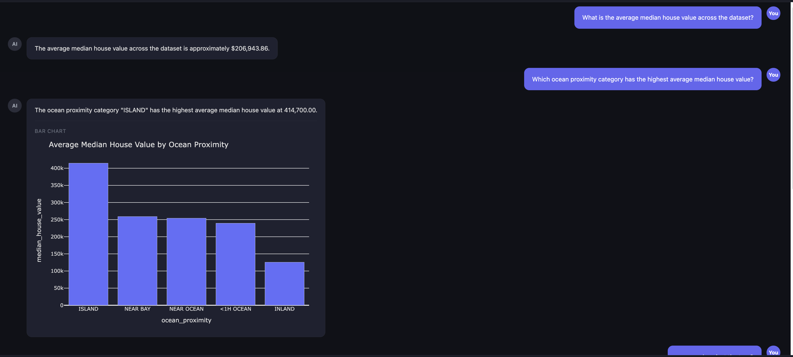
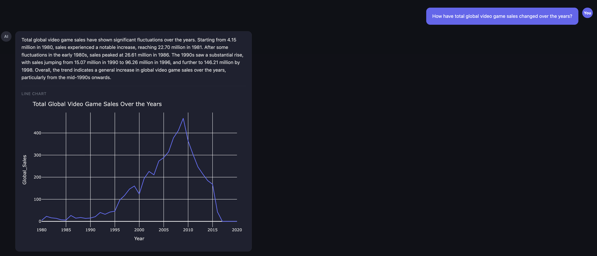
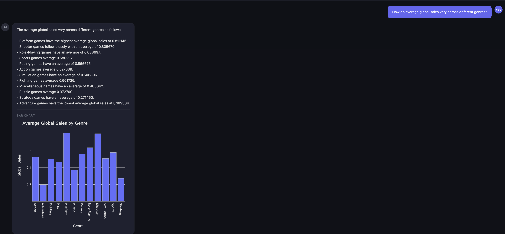
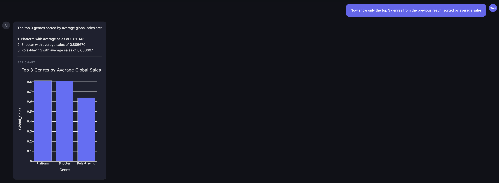
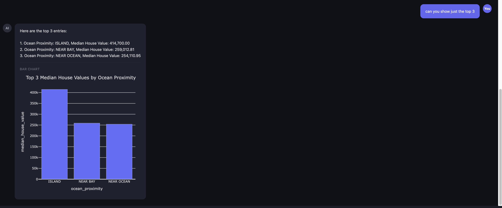

# ECE 157C / ECE 272C — Homework 2 Report
# Designing an Interactive Data Analysis Agent with Visualization and Memory

**Name:** Andrew Yanez

---

## 1. System Architecture Overview

The system is a stateful, multi-turn data analysis agent built on LangGraph and served through a FastAPI backend with a chatbot-style HTML/JavaScript frontend.

### Component Overview

```
User (Browser)
   │  HTTP (SSE stream)
   ▼
FastAPI Backend  (/query endpoint)
   │  Manages sessions (_sessions dict), resolves CSV path
   ▼
LangGraph Agent  (agent.py)
   │  Compiles the graph and streams node events
   ▼
Node Pipeline  (nodes.py)
   codegen_node → execute_node → evaluate_node
         ↑                              │
   retry_codegen_node ◄──── (FAIL, retry_count < 1)
                                        │ (PASS or exhaust retries)
                                        ▼
                                  respond_node → visualization_node → END
```

**Data flow summary:**
1. The backend resolves the CSV path and injects the previous `ExecutionResult` into the initial state.
2. `codegen_node` uses GPT-4o to generate pandas code, including a description of the previous result if it exists.
3. `execute_node` runs the code in a sandboxed `exec()` environment and wraps the output in an `ExecutionResult`.
4. `evaluate_node` asks GPT-4o to judge whether the result is correct; if it returns FAIL the graph retries once.
5. `respond_node` generates a natural-language answer from the result.
6. `visualization_node` asks GPT-4o whether a chart would add value; if yes, it builds a Plotly figure.
7. The final SSE event carries the answer, generated code, execution result JSON, and Plotly figure JSON to the frontend.

---

## 2. Execution Result Design

### Representation

Every successful execution produces an `ExecutionResult` object (defined in `nodes.py`):

```python
class ExecutionResult:
    data        # the raw value: DataFrame, Series, scalar, or string
    question    # the question that produced this result
    data_type   # inferred type: "dataframe", "series", "scalar", or "string"
```

The class exposes two interfaces used by downstream components:

| Method | Purpose | Consumer |
|--------|---------|----------|
| `describe()` | Text summary (type, shape, columns, sample) | LLM prompts in `evaluate_node`, `respond_node`, `visualization_node`, `retry_codegen_node` |
| `to_json()` | JSON-serializable string (`orient="records"` for DataFrames) | Frontend via SSE `result` event |

### Why This Representation

**In-memory Python object (not serialized to disk or database).** The session dict held by the backend stores the live `ExecutionResult` object between turns. This avoids serialization overhead on every turn and lets the execute node inject `previous_result.data` directly into the `exec()` environment:

```python
if previous_result is not None:
    env["previous_result"] = previous_result.data
```

Follow-up code generated by the LLM operates on `previous_result` (a DataFrame) as a first-class Python variable — no re-reading of the original CSV is needed.

**`describe()` as the LLM interface.** Instead of passing raw DataFrames to the LLM (which would be token-expensive for large tables), `describe()` produces a compact summary capped at 500 characters. This gives the evaluator and responder enough information to judge and explain the result without hitting token limits.

**`data_type` for routing.** The `visualization_node` checks `isinstance(execution_result.data, pd.DataFrame)` before even calling the LLM. This avoids unnecessary API calls for scalar answers (e.g., "how many rows") where a chart would never be meaningful.

### Trade-offs Observed

| Design Choice | Benefit | Limitation |
|---------------|---------|-----------|
| In-memory sessions | Zero latency; no serialization | Lost on server restart; not shareable across multiple backend instances |
| Only the most recent result is carried forward | Simple state; avoids ambiguity | Cannot refer to results from two or more turns ago (e.g., "go back to what you showed in turn 1") |
| `describe()` truncated at 500 chars | Keeps prompts compact | Large DataFrames appear truncated; the LLM may miss patterns in rows not shown |
| `exec()` sandbox with shared dict env | Simple and flexible | No true isolation; malicious or buggy code could modify the env dict unexpectedly |

---

## 3. Visualization Agent Interface

### Input State

The `visualization_node` receives the full agent state dict. The relevant fields are:

| Field | Type | Description |
|-------|------|-------------|
| `question` | `str` | The user's original question |
| `execution_result` | `ExecutionResult \| None` | The structured result from `execute_node` |

The node immediately returns (no visualization) if `execution_result` is `None` or if its `data` is not a `pd.DataFrame`. Scalar and string results are never visualized.

### LLM Decision Prompt

The LLM is given:
- The DataFrame's column names
- A `describe()` summary of the result
- The user's question
- A structured JSON schema to respond with

The system prompt describes when visualization is useful (comparisons, trends, distributions, part-to-whole) and when it is not (single-row or scalar). The LLM must respond with a strict JSON object:

```json
{
  "visualize": true,
  "chart_type": "bar",
  "x_col": "ocean_proximity",
  "y_col": "median_house_value",
  "title": "Average Median House Value by Ocean Proximity"
}
```

A regex fallback strips any markdown fences the LLM occasionally wraps around the JSON.

### Output State

The node writes four fields into the agent state:

| Field | Type | Description |
|-------|------|-------------|
| `visualization_decision` | `bool` | Whether the LLM decided to visualize |
| `visualization_chart_type` | `str` | Chart type chosen: bar, line, scatter, histogram, box, pie, or none |
| `visualization_figure` | `str \| None` | Plotly figure serialized as JSON via `fig.to_json()` |
| `visualization_error` | `str \| None` | Error message if figure building failed |

### How the Output Is Used by the Frontend

The backend's `/query` SSE endpoint emits the final `result` event that includes:

```json
{
  "visualization": {
    "enabled": true,
    "chart_type": "bar",
    "figure_json": "{ ... Plotly figure JSON ... }",
    "error": null
  }
}
```

The frontend JavaScript parses `figure_json` and calls `Plotly.newPlot()` with the figure's `data` and `layout` arrays, applying dark-theme overrides (`paper_bgcolor`, `plot_bgcolor`, `font.color`). Charts are rendered inline inside the assistant's chat bubble, below the text answer.

---

## 4. System Usage and Summary

All five questions below were run through the live system. Questions 4 and 5 form a multi-turn interaction where the second turn operates on the first turn's result without re-reading the CSV.

---

### Questions 1 & 2 — Housing Dataset (UI Screenshot)



---

### Question 1 — Average House Value (Scalar)

**Dataset:** California Housing (`housing.csv`)

**Question:** *"What is the average median house value across the dataset?"*

**Generated Code:**
```python
import pandas as pd
df = pd.read_csv('<csv_path>')
result = df['median_house_value'].mean()
```

**Answer:** The average median house value across the dataset is approximately **$206,943.86**.

**Visualization:** None (scalar result — no chart needed).

**Evaluation:** PASS

---

### Question 2 — Ocean Proximity Comparison (Bar Chart)

**Dataset:** California Housing (`housing.csv`)

**Question:** *"Which ocean proximity category has the highest average median house value?"*

**Generated Code:**
```python
import pandas as pd
df = pd.read_csv('<csv_path>')
result = df.groupby('ocean_proximity')['median_house_value'].mean().reset_index()
result.columns = ['ocean_proximity', 'median_house_value']
result = result.sort_values('median_house_value', ascending=False)
```

**Answer:** The "ISLAND" category has the highest average median house value at **$414,700**. NEAR BAY follows at approximately $258,749, and NEAR OCEAN at $253,831. INLAND has the lowest at $125,733.

**Visualization:** Bar chart — ocean proximity on the x-axis, average median house value on the y-axis. The LLM correctly identified this as a comparison across categories.

**Evaluation:** PASS

---

### Question 3 — Sales Trend Over Time (Line Chart)

**Dataset:** Video Game Sales (`custom_dataset.csv`)

**Question:** *"How have total global video game sales changed over the years?"*



**Generated Code:**
```python
import pandas as pd
df = pd.read_csv('<csv_path>')
df = df.dropna(subset=['Year', 'Global_Sales'])
result = df.groupby('Year')['Global_Sales'].sum().reset_index()
result = result.sort_values('Year')
```

**Answer:** Global video game sales grew from 4.15 million units in 1980, spiked to 22.70 million in 1981, and rose sharply through the 1990s and 2000s, peaking around **669 million units in 2008**. Sales declined steadily after 2009, with a sharp drop after 2015 as the dataset coverage became sparse.

**Visualization:** Line chart — year on x-axis, total global sales on y-axis. The LLM correctly identified this as a trend over time.

**Evaluation:** PASS

---

### Question 4 — Genre Sales Breakdown (Multi-turn Turn 1, Bar Chart)

**Dataset:** Video Game Sales (`custom_dataset.csv`)

**Question:** *"How do average global sales vary across different genres?"*



**Generated Code:**
```python
import pandas as pd
df = pd.read_csv('<csv_path>')
df = df.dropna(subset=['Genre', 'Global_Sales'])
result = df.groupby('Genre')['Global_Sales'].mean().reset_index()
result.columns = ['Genre', 'Average_Global_Sales']
result = result.sort_values('Average_Global_Sales', ascending=False)
```

**Answer:** Platform games have the highest average global sales at **0.811M units**, followed by Shooter (0.806M) and Role-Playing (0.639M). Adventure games have the lowest average at 0.189M. The result is a 12-row DataFrame (one row per genre) stored as the session's execution result.

**Visualization:** Bar chart — genre on x-axis, average global sales on y-axis.

**Evaluation:** PASS

---

### Question 5 — Top 3 Genres (Multi-turn Turn 2, Follow-up)

**Dataset:** (same session — previous result reused)

**Question:** *"Now show only the top 3 genres from the previous result, sorted by average sales"*



**How memory is used:** The backend passes the Q4 `ExecutionResult` (the 12-row genre DataFrame) as `previous_result` in the initial state. The codegen prompt tells the LLM that `previous_result` is available and instructs it to operate on it directly — no CSV re-read occurs:

```python
# No CSV re-read — operates on previous_result (the 12-row DataFrame from Q4)
result = previous_result.sort_values('Average_Global_Sales', ascending=False).head(3)
```

**Answer:** The top 3 genres by average global sales are:
1. **Platform** — 0.811M
2. **Shooter** — 0.806M
3. **Role-Playing** — 0.639M

**Visualization:** Bar chart of the 3-row result. The chart correctly reflects only the top 3 genres, not all 12 from the previous turn. This confirms the memory system is working: the LLM operated on the stored `ExecutionResult` rather than re-querying the dataset.

**Evaluation:** PASS

---

### Bonus — Housing Multi-turn: "Can you show just the top 3?"

The screenshot below shows a separate multi-turn session on the housing dataset, where the follow-up "can you show just the top 3" correctly filters the previous ocean proximity result to the three highest-value categories (ISLAND, NEAR BAY, NEAR OCEAN) and renders a new bar chart — again without re-reading the CSV.



---

### Summary of Insights

| # | Dataset | Key Finding |
|---|---------|-------------|
| 1 | Housing | California homes average $207K; significant variation exists by location |
| 2 | Housing | Island properties command 60% higher prices than the next category (Near Bay) |
| 3 | VG Sales | The industry peaked in 2008 (~669M units); the decline post-2009 reflects market consolidation and mobile shift |
| 4 | VG Sales | Platform and Shooter genres dominate average per-game sales; Adventure is the weakest |
| 5 | VG Sales | (Follow-up) Platform, Shooter, Role-Playing form a clear top tier with a gap to the next genre |

The multi-turn interaction (Questions 4→5) demonstrates that the system correctly reuses the prior DataFrame rather than re-querying the CSV — the generated code references `previous_result` and applies `.head(3)` directly. This is the core correctness property required by the assignment.

---

## 5. Failure Case

### Limitation: Memory Carries Only the Immediately Previous Result

**What goes wrong:** The session state stores only the most recent `ExecutionResult`. If a user asks three questions and then says "compare this to what you showed in question 1," the system has no access to turn 1's result. It will either generate code that re-reads the CSV (which may not replicate the original query) or fail entirely if the follow-up refers to data that no longer exists in the current state.

**Example failure sequence:**
1. Q1: "What is the average income by ocean proximity?" → stores result A
2. Q2: "Now sort by income descending." → operates on result A, stores result B
3. Q3: "Compare result B with what I showed in Q1." → the system only has result B; result A is gone

**Why this happens:** The `_sessions` dict stores only `execution_result` (singular). Each new turn overwrites the previous slot. There is no history of prior results — only a history of question/answer pairs, which is only useful for conversational context (included in the chat display) but not for re-execution.

**What went wrong (technically):** The session design:
```python
_sessions[conversation_id] = {
    "csv_path": csv_path,
    "execution_result": new_result,   # ← overwrites every turn
    "history": history,
}
```
stores only the latest result. Earlier results are discarded after each turn.

**How the system could be improved:** Store a list of `ExecutionResult` objects indexed by turn number. The codegen prompt could then expose multiple named results (e.g., `result_turn_1`, `result_turn_2`) and the LLM could reference the appropriate one. Alternatively, store only results that the user explicitly "pins" (e.g., "remember this result") to avoid unbounded memory growth. Either approach would require changes to the session schema and the codegen system prompt.

---

## 6. Project Structure

```
project/
├── agent.py
├── nodes.py
├── backend/
├── frontend/
├── datasets/
├── results.csv
└── Report.pdf
```
