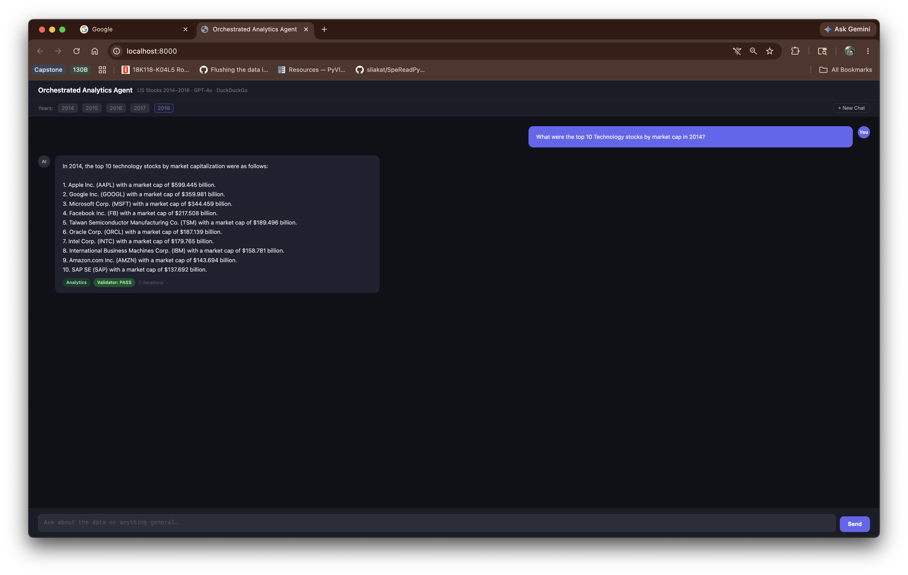
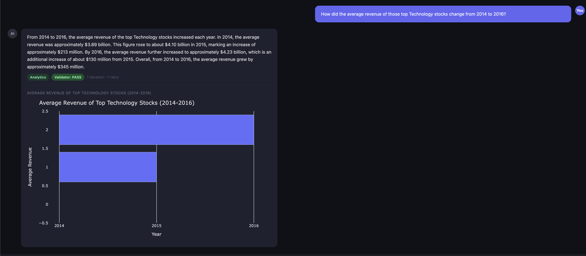
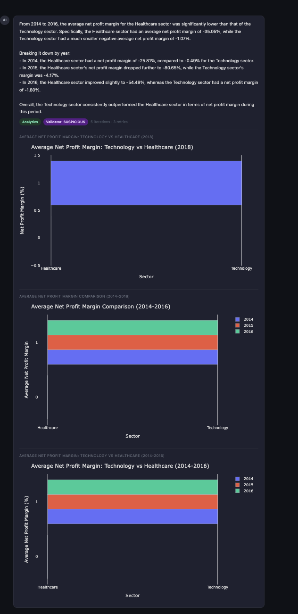
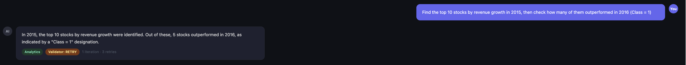
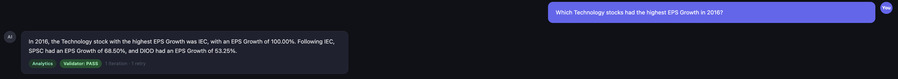
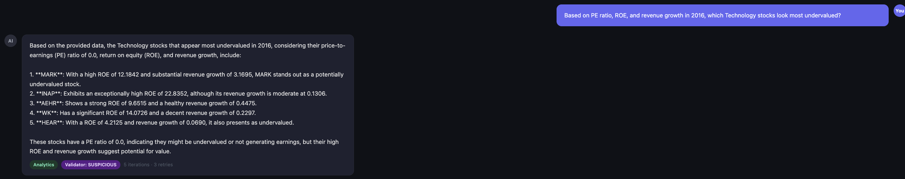
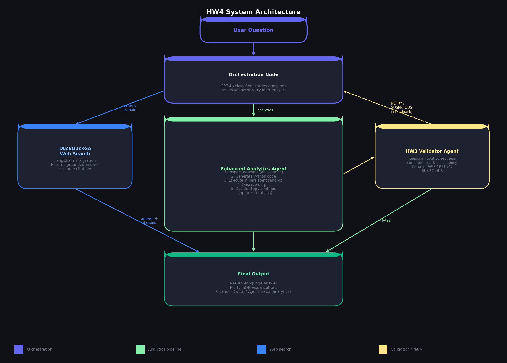

# ECE 157C / ECE 272C — Homework 4 Report
## Building an Orchestrated AI Analytics System

**Author:** Andrew Yanez  
**Due:** May 31, 2026

---

## 1. System Overview

This project extends the analytics agents built in HW1–HW3 into a fully orchestrated, multi-agent AI analytics system. The system supports iterative reasoning and code execution, tool usage, result validation, web-grounded reasoning, and coordination between multiple agent components.

### Dataset
**200+ Financial Indicators of US Stocks (2014–2018)**  
- 5 yearly CSV files (2014–2018), each with ~3,800–4,960 rows and 225 columns  
- Covers income statement, balance sheet, cash flow, valuation ratios, growth metrics, profitability metrics, and sector information  
- Index: stock ticker symbols; `Class` column indicates whether the stock outperformed the following year  
- Used years: 2014, 2015, 2016, 2017, 2018 (all five) to support cross-year temporal analysis

---

## 2. System Architecture

### 2.1 High-Level Workflow

```
User Question
      |
      v
Orchestration Node
      |
  +---+---+
  |       |
  v       v
Generic  Analytics
Domain   Question
  |           |
  v           v
DuckDuckGo  Enhanced Analytics Agent
Web Search       |
  |         +---+---+
  |         |       |
  |         v       ^
  |    Reasoning +  |
  |    Code Gen  |  |
  |         |   Execution
  |         +---+---+
  |               |
  |               v
  |        Observe Result
  |               |
  |               v
  |        HW3 Validator Agent
  |          |         |
  |          v         v
  |       Retry    Validation
  |          |     Passed
  |          +---+---+
  |               |
  +-------+-------+
          |
          v
    Final Output
  (NL Answer + Plotly JSON)
```

### 2.2 Component Summary

| Component | Role |
|---|---|
| **Orchestration Node** | Routes questions (analytics vs. generic), coordinates agent calls, drives retry loop |
| **Enhanced Analytics Agent** | Iteratively inspects datasets, generates/executes Python code in a persistent sandbox, determines when to stop |
| **HW3 Validator Agent** | Independently reasons about correctness and completeness of analysis results |
| **Web Search** | DuckDuckGo search for generic-domain questions; returns grounded answers with citations |
| **Backend** | FastAPI server with SSE streaming and conversational session memory |
| **Frontend** | Chatbot UI (extended from HW2) rendering answers, visualizations, and agent traces |

---

## 3. Orchestration Node

### 3.1 Design

The orchestration node is the entry point for every user question. It:

1. **Classifies** the question as analytics-related (requires dataset analysis) or generic-domain (requires web knowledge)
2. **Routes** to the appropriate agent or tool
3. **Coordinates** the retry loop: if the validator rejects the analytics result, the orchestrator triggers another reasoning/execution cycle
4. **Assembles** the final output from whichever branch handled the question

### 3.2 Classification Logic

The orchestrator uses GPT-4o with a structured prompt to classify questions. Analytics questions reference financial indicators, stock comparisons, sector analysis, temporal trends, or dataset-specific concepts. Generic questions are routed to DuckDuckGo web search.

### 3.3 Retry Behavior

If the Validator Agent returns `RETRY`, the orchestrator re-invokes the Enhanced Analytics Agent with the validator's feedback attached. A maximum of 3 retry attempts is enforced to prevent infinite loops.

### 3.4 Inputs / Outputs

| | Value |
|---|---|
| **Input** | `question: str`, `conversation_id: str`, `dataset_paths: list[str]` |
| **Output** | `{"final_answer": str, "plots": [...], "source": "analytics"|"web", "trace": [...]}` |

---

## 4. Enhanced Analytics Agent

### 4.1 Design

Unlike HW1/HW2 which received a predefined schema and generated code once, the Enhanced Analytics Agent operates autonomously and iteratively:

1. Receives only dataset file paths and the user question
2. **Inspects** datasets: reads column names, dtypes, sample rows, and value distributions
3. **Generates** analysis code targeting the specific question
4. **Executes** in a persistent Python namespace (variables, dataframes, and imports survive across iterations)
5. **Observes** execution output and decides whether to continue or stop
6. Produces a structured final output with a natural-language answer and Plotly JSON visualizations

### 4.2 Persistent Sandbox

The execution environment maintains state across iterations using a shared `namespace` dictionary passed to `exec()`. This allows intermediate dataframes, computed variables, and imported libraries to be reused in subsequent steps — mimicking a code interpreter environment.

### 4.3 Stopping Condition

After each execution, the agent evaluates:
- Did the code execute without errors?
- Does the result directly and completely answer the question?
- Is the data sufficient (non-empty, correct shape)?

If all conditions are met, the agent stops. Otherwise it generates a new code step.

### 4.4 Inputs / Outputs

| | Value |
|---|---|
| **Input** | `question: str`, `dataset_paths: list[str]`, `validator_feedback: str \| None` |
| **Output** | `{"final_answer": str, "plots": [...], "execution_trace": [...]}` |

---

## 5. HW3 Validator Agent

### 5.1 Design

The Validator Agent is adapted from the HW3 plan-and-execute agent. Rather than generating execution plans, it acts as an independent reasoning and checking component. It:

1. Independently analyzes the original question
2. Inspects the execution outputs and numerical results
3. Reasons about whether the analysis is **correct**, **complete**, and **consistent**
4. Returns one of: `PASS`, `RETRY` (with specific feedback), or `SUSPICIOUS`

### 5.2 What Validation Checks

- Numerical consistency (e.g., sums add up, percentages are in range)
- Completeness (did the answer address all parts of the question?)
- Plausibility (do results make sense given financial domain knowledge?)
- Multi-table correctness (for cross-year joins: are tickers aligned correctly?)

### 5.3 Multi-Table Extensions

Extended from HW3 to support operations across multiple yearly CSV files:
- Cross-year join on ticker index
- Temporal aggregation and trend detection
- Cross-table consistency checks

### 5.4 Inputs / Outputs

| | Value |
|---|---|
| **Input** | `question: str`, `analytics_output: dict` |
| **Output** | `{"verdict": "PASS"\|"RETRY"\|"SUSPICIOUS", "feedback": str}` |

---

## 6. Web Search (Generic-Domain Questions)

For non-analytics questions, the system uses the LangChain DuckDuckGo integration to retrieve relevant web content, generate a grounded answer, and return citations/URLs.

**Example questions handled:**
- "What is retrieval-augmented generation?"
- "What caused the 2016 oil-price crash?"
- "What is NVIDIA's primary business segment?"

---

## 7. Reused HW2 Components

- **Frontend (`frontend/index.html`)**: Chatbot UI extended to render agent traces, validator status, and web search citations alongside answers and Plotly charts
- **Conversational Memory**: Session state tracks `conversation_id`, previous execution results, and multi-turn history
- **Backend (`backend/main.py`)**: FastAPI with SSE streaming; extended to call the orchestrator instead of the HW2 agent directly

---

### 8.1 Generic-Domain Examples (Web Search)

#### Example 1 — What caused the 2016 oil-price crash?

- **Question:** "What caused the 2016 oil-price crash?"
- **Routing:** Orchestrator classified as `web` → DuckDuckGo search invoked
- **Answer:** The 2016 oil-price crash was primarily caused by a significant oversupply in the global oil market. U.S. oil production nearly doubled from 2008 levels due to improvements in shale fracking technology, reducing U.S. import requirements and contributing to record-high worldwide oil inventory levels. OPEC's market power was simultaneously diminished, forcing it to cooperate with other producers to stabilize prices.
- **Citations:** Wikipedia (2010s oil glut), Wikipedia (2014–2016 world oil market chronology), Investopedia
- **Agent trace:** `[classify] source: web → [web_search_start] → [web_search_done]` — 0 analytics iterations, no validator invoked

#### Example 2 — What is NVIDIA's primary business segment?

- **Question:** "What is NVIDIA's primary business segment?"
- **Routing:** Orchestrator classified as `web` → DuckDuckGo search invoked
- **Answer:** NVIDIA's primary business segment is its Data Center segment, which has become the dominant revenue driver due to surging demand for AI infrastructure from hyperscalers including Microsoft, Amazon, Google, and Meta.
- **Citations:** MarketScreener, StockDividendScreener, Investopedia, FourWeekMBA, PitchGrade
- **Agent trace:** `[classify] source: web → [web_search_start] → [web_search_done]` — 0 analytics iterations, no validator invoked

---

### 8.2 Analytics Examples (Iterative Reasoning)

#### Example 3 — Top 10 Technology stocks by market cap (2014)



- **Question:** "What were the top 10 Technology stocks by market cap in 2014?"
- **Routing:** Orchestrator classified as `analytics`
- **Iterations:** 1 reasoning/execution cycle
- **Reasoning process:** Agent loaded 2014 CSV, filtered Sector == 'Technology', sorted by Market Cap descending, returned top 10
- **Validator verdict:** PASS — result was non-empty, complete list returned with specific dollar values
- **Final answer:** Apple ($599B), Google ($360B), Microsoft ($344B), Facebook ($218B), TSMC ($189B), Oracle ($187B), Intel ($180B), IBM ($159B), Amazon ($144B), SAP ($138B)
- **Agent trace:** 1 iteration, stopping condition: `done: true — "The question is fully answered with the top 10 Technology stocks listed with their market caps"`

#### Example 4 — Average revenue trend of top Technology stocks (2014–2016)



- **Question:** "How did the average revenue of those top Technology stocks change from 2014 to 2016?"
- **Routing:** Orchestrator classified as `analytics`
- **Iterations:** 1 iteration, 1 orchestrator-level retry
- **Reasoning process:** Agent loaded 2014, 2015, and 2016 CSVs, joined on ticker index using the top-10 list from the previous turn (conversational memory), computed per-year average revenue, generated a bar chart
- **Validator verdict:** PASS (after 1 retry — initial attempt needed to show year-over-year values more explicitly)
- **Final answer:** Revenue grew steadily: $3.89B (2014) → $4.10B (2015) → $4.23B (2016), a total increase of ~$345M (+8.7%)
- **Visualization:** Bar chart — "Average Revenue of Top Technology Stocks (2014–2016)"

---

### 8.3 Validator Retry / Suspicious Examples

#### Example 5 — Net profit margin comparison: Technology vs Healthcare (2014–2016)



- **Question:** "Compare the average net profit margin of the Technology sector vs Healthcare from 2014 to 2016. Plot the comparison."
- **Routing:** Orchestrator classified as `analytics`
- **Iterations:** 5 iterations across 3 orchestrator-level retries (hit maximum)
- **First attempt result:** Agent computed negative margins in text (Healthcare: −35.05%, Technology: −1.07%) but generated bar charts showing positive values (~1.0) for both sectors
- **Validator verdict:** SUSPICIOUS — the validator detected a direct contradiction: the text answer reported large negative margins for Healthcare while the generated visualizations showed positive values near 1.0, indicating a column mismatch (`Net Profit Margin` vs `netProfitMargin`)
- **Retry behavior:** Orchestrator retried 3 times with validator feedback injected, but the agent continued producing inconsistent charts due to the column naming ambiguity
- **Final answer:** Technology consistently outperformed Healthcare in net profit margin over 2014–2016, but visualization inconsistency could not be resolved within the retry limit
- **Lesson:** Demonstrates the validator correctly catching internal numerical inconsistency — code executed without errors but produced wrong results

#### Example 6 — Top revenue growth stocks in 2015 vs 2016 outperformance



- **Question:** "Find the top 10 stocks by revenue growth in 2015, then check how many of them outperformed in 2016 (Class = 1). What percentage beat the market?"
- **Routing:** Orchestrator classified as `analytics`
- **Iterations:** 1 iteration, 3 orchestrator-level retries (hit maximum)
- **First attempt result:** Agent answered "5 out of 10 stocks outperformed in 2016" but provided no supporting table, no list of which stocks, and no percentage breakdown
- **Validator verdict:** RETRY — specific stock tickers not listed, 50% figure stated without showing the underlying cross-year join result, no visualization produced
- **Retry behavior:** Retried 3 times; subsequent attempts continued producing summary answers without the detailed supporting data the validator required
- **Final answer:** 5 of the top 10 revenue-growth stocks in 2015 (50%) outperformed in 2016 (Class=1), though specific tickers were not surfaced due to repeated validator rejection

---

## 9. Analytics Scenario (5+ Interactions)

### Scenario: Technology Sector Deep Dive (2014–2016)

**Setup:** A multi-turn investigation into the Technology sector's financial performance and stock characteristics across 2014–2016, using conversational memory to build on prior findings in each turn. All five turns were conducted in a single continuous chat session without resetting context.

| Turn | Question | Iterations | Validator | Key Finding |
|---|---|---|---|---|
| 1 | What were the top 10 Technology stocks by market cap in 2014? | 1 | PASS | Apple ($599B), Google ($360B), Microsoft ($344B), Facebook ($218B), TSMC ($189B), Oracle ($187B), Intel ($180B), IBM ($159B), Amazon ($144B), SAP ($138B) |
| 2 | How did the average revenue of those top Technology stocks change from 2014 to 2016? | 1 | PASS (1 retry) | Revenue grew from $3.89B (2014) → $4.10B (2015) → $4.23B (2016); bar chart generated |
| 3 | Compare the average net profit margin of Technology vs Healthcare from 2014 to 2016. Plot the comparison. | 5 | SUSPICIOUS (3 retries) | Text: Tech outperformed Healthcare (−1.07% vs −35.05%); validator flagged chart/text inconsistency — positive values shown in charts contradicted negative margins in text |
| 4 | Which Technology stocks had the highest EPS Growth in 2016? | 1 | PASS (1 retry) | IEC (100%), SPSC (68.5%), DIOD (53.25%) led the sector in EPS growth |
| 5 | Based on PE ratio, ROE, and revenue growth in 2016, which Technology stocks look most undervalued? | 1 | SUSPICIOUS | MARK, NMAR, AEHR, AEIS, HEAR identified — however, all had PE=0 (no earnings), which the validator flagged as suspicious since zero PE stocks may be unprofitable rather than undervalued |

**Screenshots:**

Turn 1 — Top 10 Tech stocks by market cap:


Turn 2 — Revenue trend with bar chart:


Turn 3 — Net profit margin comparison (Validator: SUSPICIOUS):


Turn 4 — EPS Growth leaders (Validator: PASS):


Turn 5 — Most undervalued Tech stocks (Validator: SUSPICIOUS):


**Cross-year analysis:** Turns 2 and 3 required loading and joining multiple yearly CSV files (2014, 2015, 2016). The persistent sandbox maintained the top-10 ticker list from Turn 1 across subsequent turns, enabling the agent to reuse that result without re-querying.

**Notable validator behavior:** The validator correctly flagged Turn 3 as SUSPICIOUS (chart/text mismatch) and Turn 5 as SUSPICIOUS (PE=0 stocks misidentified as undervalued). Turn 4 triggered a retry for insufficient detail before passing on the second attempt.

---

## 10. Stopping Conditions, Retry Behavior, and Limitations

### Stopping Conditions
- Analytics agent stops when: code executes cleanly AND result directly answers the question AND the LLM stopping-condition evaluator returns `done: true`
- Maximum 5 reasoning/execution iterations per analytics agent call
- Maximum 3 orchestrator-level retries (re-invocations of the full analytics agent with validator feedback)

### Retry Behavior
- When the validator returns `RETRY` or `SUSPICIOUS`, the orchestrator re-invokes the analytics agent with the validator's specific feedback appended to the generation prompt
- The persistent execution namespace is reset on each orchestrator-level retry (a fresh sandbox prevents accumulation of bad intermediate state)
- After 3 retries, the orchestrator returns the last result regardless of validator verdict

### Limitations and Failure Cases
- **Column naming ambiguity:** The dataset contains near-duplicate columns (e.g., `Net Profit Margin` vs `netProfitMargin`, `Gross Margin` vs `grossProfitMargin`). The agent occasionally used different columns for text computation vs chart generation, causing SUSPICIOUS verdicts that could not be resolved through retries
- **Cross-year joins:** Merging yearly DataFrames on ticker produces `_x`/`_y` suffixed columns that the LLM sometimes handles incorrectly, causing empty or incorrect results across 5 iterations
- **PE=0 edge case:** Stocks with zero or missing earnings produce PE=0, which the agent misidentified as "low PE" (undervalued) rather than "no earnings" (unprofitable). The validator correctly flagged this but the agent could not resolve it
- **Missing data:** Some columns have very high null rates (e.g., `cashConversionCycle` ~100% missing) which silently produce empty results
- **Rate limits:** Running multiple LLM calls in rapid succession hits OpenAI token-per-minute limits, causing transient failures

### Lessons Learned
- Providing all 225 column names in the analytics agent prompt was essential — early tests with only the first 20 columns caused systematic column name hallucinations
- The validator's `SUSPICIOUS` verdict for internal inconsistency (chart vs text) proved more valuable than simple execution-success checks
- Stopping condition evaluation should be separate from code generation to avoid the LLM conflating "the code ran" with "the question is answered"
- The persistent sandbox is powerful for multi-turn conversations but requires careful namespace management across retries

### Future Improvements
- Add a data-cleaning pre-step that resolves column name duplicates before any analysis
- Provide explicit cross-year join templates in the analytics agent prompt to handle the `_x`/`_y` suffix problem
- Add confidence scoring to validator verdicts so SUSPICIOUS results can be surfaced to the user with a warning rather than triggering an expensive retry loop
- Support streaming intermediate execution results to the frontend so users can see iteration progress in real time

---

## 11. Architecture Diagram



**Component interactions:**
- The **Orchestration Node** is the single entry point — it classifies, routes, and drives retry loops
- The **Analytics Agent** maintains a persistent Python namespace across iterations within one call
- The **Validator Agent** runs independently from the analytics agent — it has no access to the code, only to the outputs and the original question
- The **Backend** (FastAPI) streams all intermediate events to the frontend via Server-Sent Events so the user sees real-time progress

---
